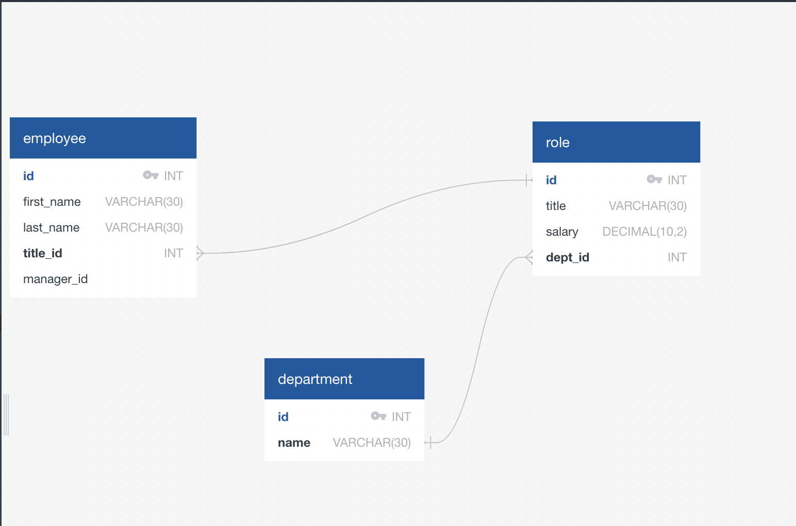

# employee-tracker

## License

## Screenshot

## Description
This is an employer tracker. It keeps track of every employee in the company depending on their name, their role orwho they report to.

## Usage
To be able to use the application, the user has to install few things such as mysql, ...

## Developer
- Rim Zoungrana
- github.com/Shalah